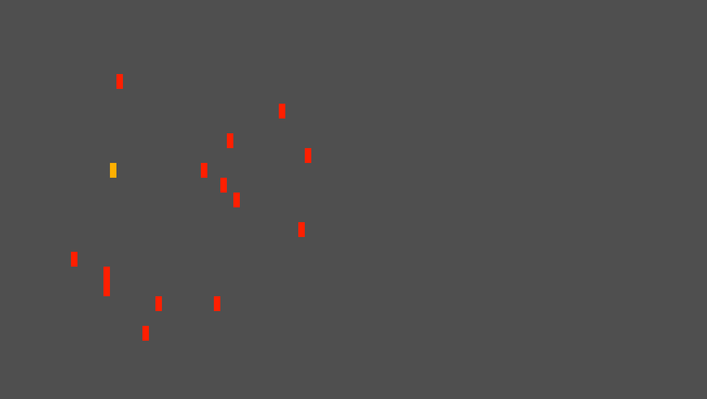
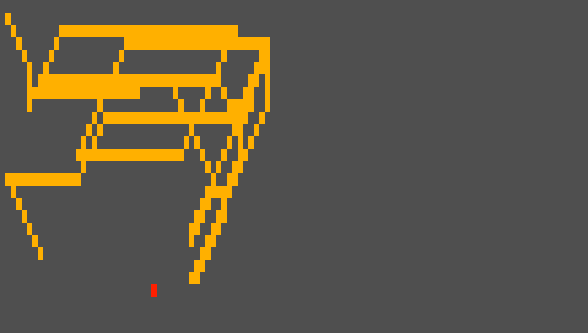
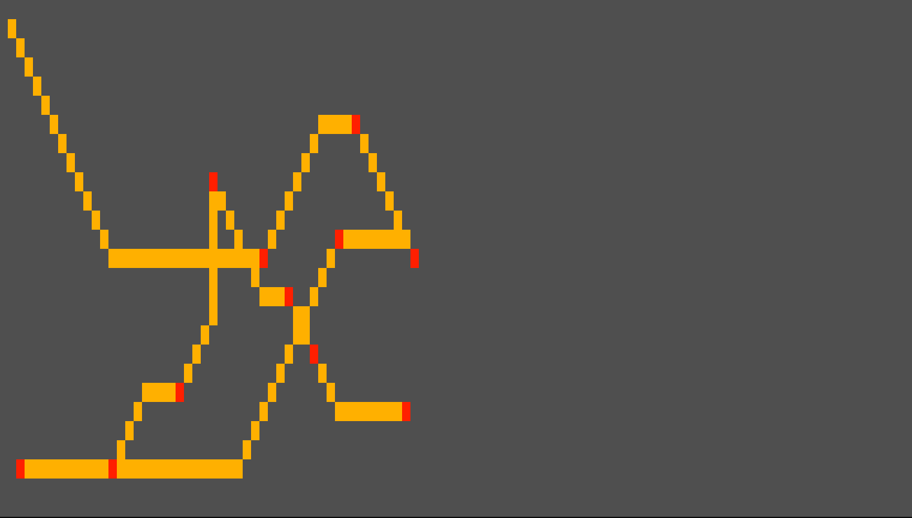

# Pointer.


[](https://github.com/w1nsh/pointer/blob/main/LICENSE)

Pointer - проект, генерирующий анимацию движения точки к случайно сгенерированной метке в кастомизируемом поле терминала


## Изображения

config:
 - del_tail: true
 - del_last: true


config:
 - del_tail: true
 - del_last: false


config:
 - del_tail: false
 - del_last: true


config:
 - del_tail: false
 - del_last: false


## Сочетания клавиш
 - `ctrl + q` - Завершение исполнения программы
 - `ctrl + w` - Открытие Github автора


## Особенности
 - Кроссплатформенность (win, mac, linux)
 - Настройка цветов (rgb)
 - Настройка границ, отступов и позиций
 - Настройка временного промежутка между действиями (tick)


## Установка
### Загрузка

```bash
git clone https://github.com/w1nsh/pointer.git
cd pointer
```

Если вы используете Windows:
 
 ```bash
 pip install -r requirements-win.txt
 ```
### Настройка
Настройка скрипта производится за счет файла `config.json`
Он расположен по пути `.../pointer/config/config.json`

Пример `config.json`:
```json
{
	"checkpoint": {
		"border": {
			"x": 50,
			"y": 25
		},
		"indent": {
			"x": 1,
			"y": 1
		},
		"color": {
			"r": 255,
			"g": 31,
			"b": 0
		},
		"del_last": true
	},
	"point": {
		"x": 0,
		"y": 0,
		"color": {
			"r": 255,
			"g": 176,
			"b": 0
		},
		"del_tail": false
	},
	"github_link": "https://github.com/w1nsh",
	"tick": 100,
	"background_color": {
		"r": 79,
		"g": 79,
		"b": 79
	}
}
```
### Запуск
```bash
python -m src
```
